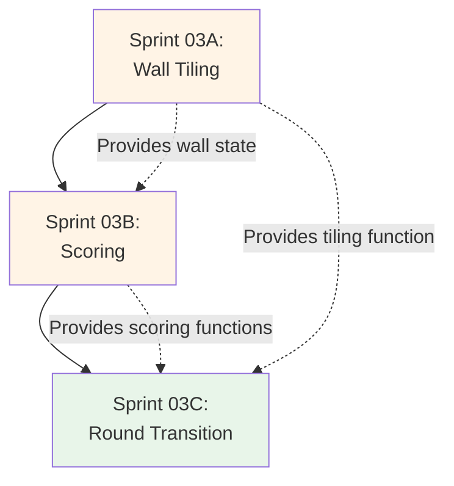

# Sprint 3 — End-of-Round + Scoring + Refill Rules

**Status:** ✅ **COMPLETED**  
**Completion Date:** January 18, 2026  
**Subdivided Into:** 3 focused sub-sprints (03A, 03B, 03C) - All Complete

> **Note:** This sprint was subdivided into 3 focused sub-sprints for better organization and incremental implementation. All sub-sprints are now complete. See [Sprint_03C_COMPLETED.md](Sprint_03C_COMPLETED.md) for detailed completion report.

**Goal:** Engine can resolve end-of-round deterministically and score correctly, enabling realistic scenario generation and rollout evaluation later.

## Outcomes
- Deterministic end-of-round resolution
- Trusted scoring via golden tests
- Correct bag/lid refill behavior for 2-player setup

---

## Subdivision Overview

This sprint has been subdivided into **three focused sub-sprints** for better organization, clearer dependencies, and incremental validation:

1. **[Sprint 03A: Wall Tiling & Pattern Line Resolution](Sprint_03A_Wall_Tiling_Pattern_Lines.md)**
   - Detect complete pattern lines
   - Place one tile on wall at correct position
   - Discard remaining tiles to lid
   - Clear pattern line state
   - Tile conservation checks

2. **[Sprint 03B: Scoring System](Sprint_03B_Scoring_System.md)**
   - Adjacency scoring (horizontal + vertical chains)
   - Floor penalty calculation (7-slot system)
   - Score clamping (cannot go below 0)
   - Golden test suite with 10+ known scenarios
   - Edge case handling

3. **[Sprint 03C: Round Transition & Refill](Sprint_03C_Round_Transition_Refill.md)**
   - Complete `resolve_end_of_round` function
   - Factory refill from bag
   - Bag refill from lid when insufficient
   - First player determination and token placement
   - Game end detection
   - WASM integration and UI button

### Subdivision Rationale

The original Sprint 03 scope involves several interconnected systems. Subdividing provides:

- **Incremental Validation:** Test wall tiling before adding scoring complexity
- **Golden Test Focus:** Sprint 03B dedicated to scoring correctness with comprehensive test suite
- **Clear Dependencies:** Each sub-sprint builds on the previous one sequentially
- **Manageable Chunks:** Each sub-sprint is 3-5 days of focused work
- **Better Documentation:** Detailed specifications for each focused area
- **Easier Debugging:** Isolate issues to specific subsystem (tiling vs scoring vs refill)

### Implementation Order

The sub-sprints must be completed sequentially due to dependencies:

### Integration Points

- **03A → 03B:** Wall state after tile placement is used for adjacency scoring
- **03A + 03B → 03C:** Tiling and scoring functions are orchestrated by end-of-round resolution
- **All → Tests:** Each sub-sprint includes tests that build on each other

---

## Scope
### 1) End-of-round resolution
- Move completed pattern lines → place 1 tile on wall + rest to lid
- Apply adjacency scoring for placed tiles
- Apply floor penalties
- Determine next-round first player based on token

### 2) Refill / setup mechanics
- Factory refill for new round from bag
- If bag insufficient, refill from lid (rules-correct)
- Define behavior when both insufficient (should still be rules-consistent)

### 3) Testing (high leverage)
- Golden tests:
  - Given fixed wall placements, expected scoring totals
  - Known edge cases for adjacency scoring
- Invariants:
  - Tile conservation including lid/bag transfers

## Deliverables
- Engine function:
  - `resolve_end_of_round(state) -> nextState`
- Golden test suite for scoring
- Optional UI button for dev: “Resolve end-of-round” (for testing)

## Acceptance Criteria
- Scoring matches expected values in golden tests
- End-of-round transformations are deterministic and correct
- Refill logic produces valid next-round states

## Demo (end-of-sprint)
- Use UI to play until drafting ends (or load a near-end state)
- Trigger end-of-round resolution
- Verify score changes + wall placements

## Dependencies
- Sprint 1 engine core

## Sprint Backlog (Organized by Sub-Sprint)

The detailed tasks for this sprint are organized within the sub-sprint documents:

### Sprint 03A Tasks ✅ Completed
- [x] Implement `resolve_pattern_lines` function
- [x] Place tiles on wall at correct positions
- [x] Discard excess tiles to lid (capacity - 1)
- [x] Reset pattern lines after resolution
- [x] Add tile conservation checks
- [x] Unit tests for pattern line resolution (8 tests)
- See [Sprint_03A_Wall_Tiling_Pattern_Lines.md](Sprint_03A_Wall_Tiling_Pattern_Lines.md) for details

### Sprint 03B Tasks ✅ Completed
- [x] Implement `calculate_wall_tile_score` function
- [x] Horizontal adjacency scoring algorithm
- [x] Vertical adjacency scoring algorithm
- [x] Implement `calculate_floor_penalty` function
- [x] Floor penalty with first-player token handling
- [x] Score clamping (cannot go below 0)
- [x] Create 10+ golden test scenarios (21 tests total)
- [x] Unit tests for all scoring functions
- See [Sprint_03B_Scoring_System.md](Sprint_03B_Scoring_System.md) for details

### Sprint 03C Tasks ✅ Completed
- [x] Implement complete `resolve_end_of_round` function
- [x] Floor line cleanup (discard to lid)
- [x] First player determination logic
- [x] Game end detection (complete horizontal row)
- [x] Implement `refill_factories` function
- [x] Bag refill from lid when insufficient
- [x] Handle partial factory fill edge case
- [x] WASM export for `resolve_end_of_round`
- [x] TypeScript wrapper and types
- [x] Dev UI button integration
- [x] Integration tests for full end-of-round flow (8 tests)
- [x] Graceful handling of invalid states (bug fix)
- See [Sprint_03C_Round_Transition_Refill.md](Sprint_03C_Round_Transition_Refill.md) for details
